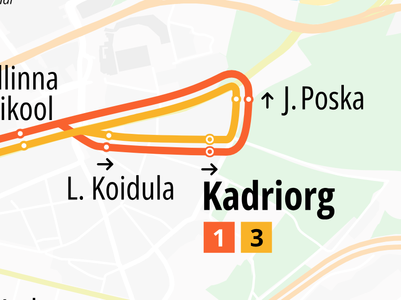
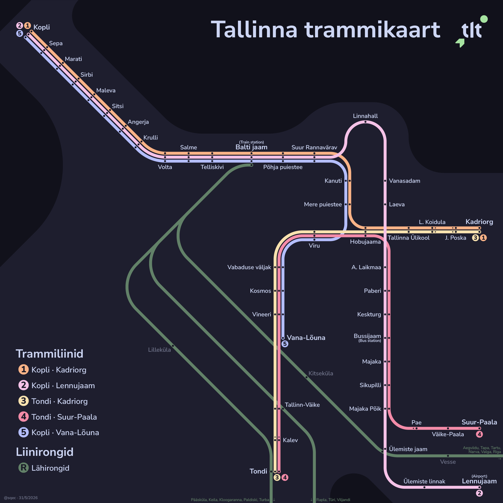

# Redesigning the Tallinn Tram Map

**31/05/2026** · Recently, people have suggested that I make a tram map for Tallinn. While researching, I came across a [tram map of Tallinn on Reddit](https://www.reddit.com/r/TransitDiagrams/comments/1p7ezzq/oc_tallinn_estonia_tram_map_in_the_style_of_oslos/). However, I realised this wasn't really geographically accurate, so I started making my own sketches.

The original tram map did not contain the routes for buses nor trains. I was originally going to include buses, but the latest map was from 2022 and every other map was interactive and outdated. As such, I went with a green colour for trains on my map.

The first issue was how to display the loop section around Kadriorg.

Eventually, I settled on something akin to the Oslo redesign:

After making the regional rails slightly darker, I am quite happy with this result.

Of course, there are improvements to be made. Firstly, The downtown is a little crowded, and the interchanges are not very obvious. The commuter rail also takes up quite a bit of space.

---

[← Return to home](/studio/)
